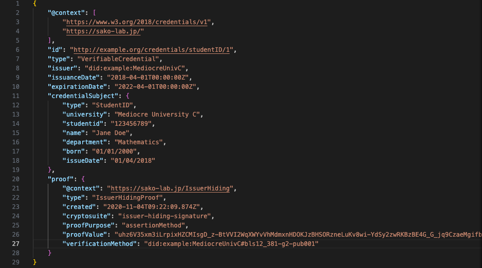
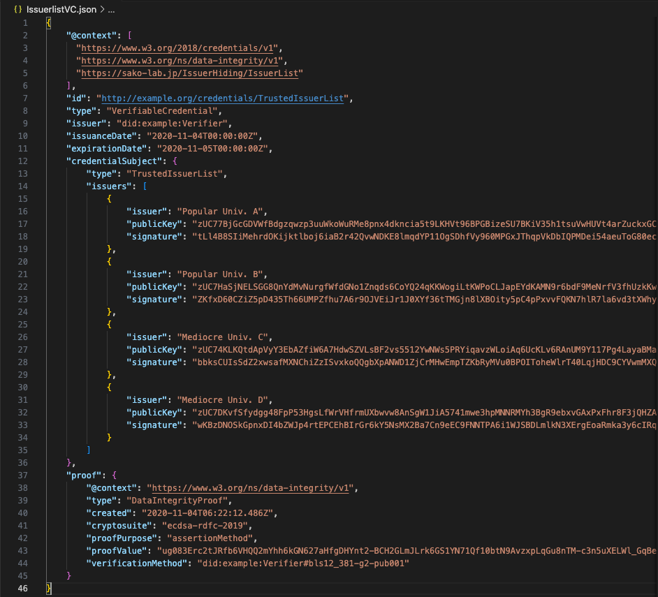

## Table of Contents:

- Introduction
- Ecosystem of Verifiable Credentials
- Problem with Current VC
- Issuer Hiding with Trusted List
- Demonstrations
- Use Case 1: Student Access to Rental Car Service with Parking Block Control
- Use Case 2: Accessing Academic Paper Search Systems while Hiding University Affiliation
- VC Format for Issuer Hiding
- Tech stuff and references
- Tech resources we created

## 1. Introduction:

Verifiable Credentials (VCs) can represent all the information that physical credentials contain while offering enhanced privacy through using cryptographic schemes such as digital signatures and zero-knowledge proofs. While VCs provide improved privacy and tamper-proof design compared to physical credentials, the technology faces a key limitation:
Issuers' public keys will be exposed to the public for verification purposes, potentially compromising the holders’ privacy.

One of the biggest societal problems, not only in Japan but also in many Asian countries, is discrimination against individuals based on the prestige of their graduated universities. Our university affiliations are among our strongest identifiers, affecting us throughout our lives, and most particularly in job hunting.
In this project, we address this critical limitation by implementing issuer hiding capabilities in a Wallet App and demonstrating its use through two practical applications: proving your identity for an academic paper search system using student card VCs with issuer hiding and a privacy-preserving student discount car rental service. These use case demonstrations illustrate the power of issuer hiding and how it could help address educational discrimination in our society.

## 2. Ecosystem of Verifiable Credentials:

The W3C[1] has established a standardized ecosystem for Verifiable Credentials that consists of three primary roles:

Issuer: The entity that creates and signs Verifiable Credentials using their private key. Issuers can be educational institutions, government agencies, or any authorized organization that issues credentials.
Holder: The entity that receives and stores Verifiable Credentials. Holders can selectively choose which attributes to disclose and present it as Verifiable Presentations (VP).
Verifier: The entity that receives and validates VPs. Verifiers use the Issuer's public key to verify the authenticity of the presented credentials.

Furthermore, by combining selective disclosure and unlinkability, Holder can control which attributes they present to Verifiers without linking them to previously presented VPs, which enhances privacy and allows users to have stronger control over their identities.

The typical process flow in this VC ecosystem proceeds as follows:

 The Issuer creates a Verifiable Credential by signing it with their private key and issues it to the Holder
 The Holder stores the credential and can create Verifiable Presentations by selecting specific attributes to share 
 The Verifier receives the Verifiable Presentation and verifies the signature using the Issuer's public key

Figure1: Overview of the VC ecosystem

## 3. Problem with Current VC:

Although Verifiable Credentials enable enhanced privacy, the current VC system has one drawback: it requires the Issuer’s public key to be exposed to enable verification. This limitation introduces several privacy concerns:

1. Issuer Traceability: Verifiers can track and identify which institution issued the credential
2. Affiliation Leaking: The Holder's institutional affiliations (such as their university, employer, or healthcare provider) are automatically revealed, even when only the credential's validity needs to be proven

## 4. Issuer Hiding with Trusted List: 

To address this current Verifiable Credential problem, we utilized the Issuer Hiding concept proposed by Jan Bobolz[2] in 2021. In this paper, Bobolz et al. proposes that the Verifier can define a set of trusted issuers, and the user can then prove that their credential was issued by one of the issuers without revealing which one, using NIZK (Non-Interactive Zero-Knowledge) proofs. 
In particular, for our Issue Hiding implementation, we utilize Protego[3], an ad-hoc delegatable credential framework that allows credential owners to choose a set of issuer public keys and prove that their credential was issued by one of these keys. 
Protego is based on the paper "Protego: A Credential Scheme for Permissioned Blockchains[4]" and its implementation is being developed by Dock[5].

After integrating Issuer Hiding into the original VC ecosystem, the updated VC flow works as follows:

1. The Issuer creates a Verifiable Credential by signing it with their private key and issues it to the Holder
2. The Holder stores the VC in their wallet
3. The Verifier sends a Trusted Issuer List to the Holder
4. The Holder selectively chooses attributes to disclose in their VP, which is signed by one of the Issuers from the Trusted Issuer List
5. The Verifier receives the Verifiable Presentation and verifies whether the signature's corresponding public key is included in the Trusted Issuer List

Figure2:  Verifiable Credential with Issuer Hiding: Issuing VC phase

Figure3: Verifiable Credential with Issuer Hiding: Sending Trusted Issuer List phase

Figure4: Verifiable Credential with Issuer Hiding: Presenting VP phase

## 5. Demonstrations

As mentioned in the Introduction, Asian countries face significant academic background discrimination. Therefore, our demonstrations focus on student card VC use cases to showcase the effectiveness of issuer hiding in addressing this problem.

## Use Case 1: Student Access to Rental Car Service with Parking Block Control

Our first demonstration involves student access for rental car services. 
We created a senarios that when students request an access, they must show their student cards, allowing rental car service to see their university affiliation. 
This leaks unnecessary student information, as the service only needs to verify the students’ status, not specific university affiliation. The process works as follows:

1. The Issuer issues student card VC to university students
2. Students receive the VC in our implemented Flutter wallet app
3. Students scan the QR code on the display machine, receive the challenge, and establish a temporary session
4. Students select their student card VC with with the Issuer’s hidden signature and send it through the established session
5. The display machine verifies the student card VC's hidden signature using zero-knowledge proofs and checks if the Issuer's corresponding public key is included in the trusted university list. If verified, students receive the discount and the parking block lowers for demonstration purposes; if not, the discount is denied and the parking block remains in place.

## Use Case 2: Accessing Academic Paper Search Systems while Hiding University Affiliation

In our second demonstration, we show how students can access academic paper search systems while hiding their university affiliation. In this scenario, universities (Issuers) issue student IDs as Verifiable Credentials to their students (Holders). While paper search websites typically allow university students free access to academic papers, students don't need to reveal which university they attend. They are only required to prove their status as "university students." The process works as follows:

1. The Issuer issues student card VC to university students
2. Students receive the VC in our implemented Flutter wallet app
3. The academic search website provides a QR code containing a challenge and enables wallet users to establish a temporary session
4. Students select their student card VC with the Issuer’s hidden signature and send it to the website through the established session
5. The website verifies the student card VC's hidden signature using zero-knowledge proofs and checks if the Issuer's corresponding public key is included in the trusted university list. If verified, the website grants access; if not, access is denied

## VC Format for Issuer Hiding
1. Student ID VC   
    Mediocre University C issues Student ID VC to User. There are 7 subjects.
    1. VC type
    2. university name
    3. student id
    4. student name
    5. student's department
    6. student's date of birth
    7. issue date   
    This VC is signed using the signature protocol for Issuer-Hiding.
    
2. Trusted Issuer list VC   
    Verifier issues Trusted Issuer list VC to User. There are four pieces of information about the Trusted Issuer consisting of three subject.
    - subject
        1. issuer name
        2. issuer's public key
        3. signature by Verifier
    - four issuers
        1. Popular University A
        2. Popular University B
        3. Mediocre University C
        4. Mediocre University D   
    This VC is signed using ECDSA.
    
3. VP   
    This VP shows that the original VC is Student ID VC and that it is within the expiration date.   
    We cannot identify who is the Issuer from this VP, but we can see the list of Trusted Issuers who may be the Issuer.
    

## Tech stuff and references

## Tech resources we created

## References: 

[1] World Wide Web Consortium : Verifiable Credentials Data Model v2.0. URL: https://www.w3.org/TR/vc-data-model-2.0/ (2024.11.03)

[2] Jan Bobolz, Fabian Eidens, Stephan Krenn, Sebastian Ramacher and Kai Samelin, Issuer-Hiding Attribute-Based Credentials, the 20th International Conference on Cryptology and Network Security CANS 2021, December 13–15, 2021

[3] Docknetworks, crypto/delegetable_credentials/src/protego, 
https://github.com/docknetwork/crypto/tree/main/delegatable_credentials/src/protego (2024.11.04)

[4] Aisling Connolly, Jerome Deschamps, Pascal Lafourcade, Octavio Perez Kempner, Protego: Efficient, Revocable and Auditable Anonymous Credentials with Applications to Hyperledger Fabric, INDOCRYPT 2022

[5] Docknetworks, Dock, https://github.com/docknetwork (2024.11.04)
